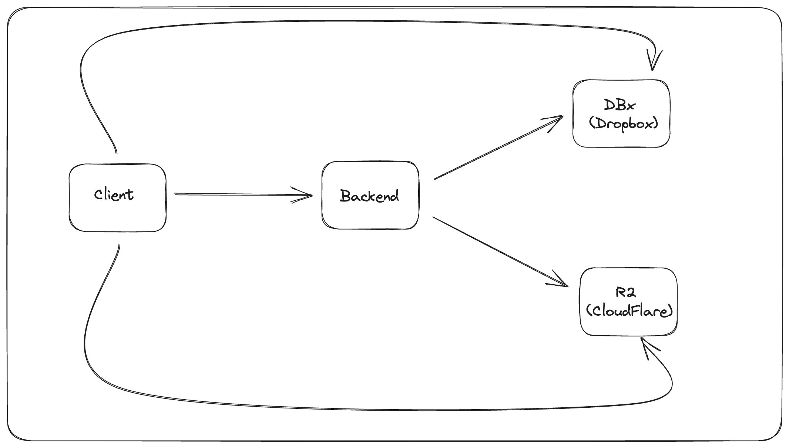
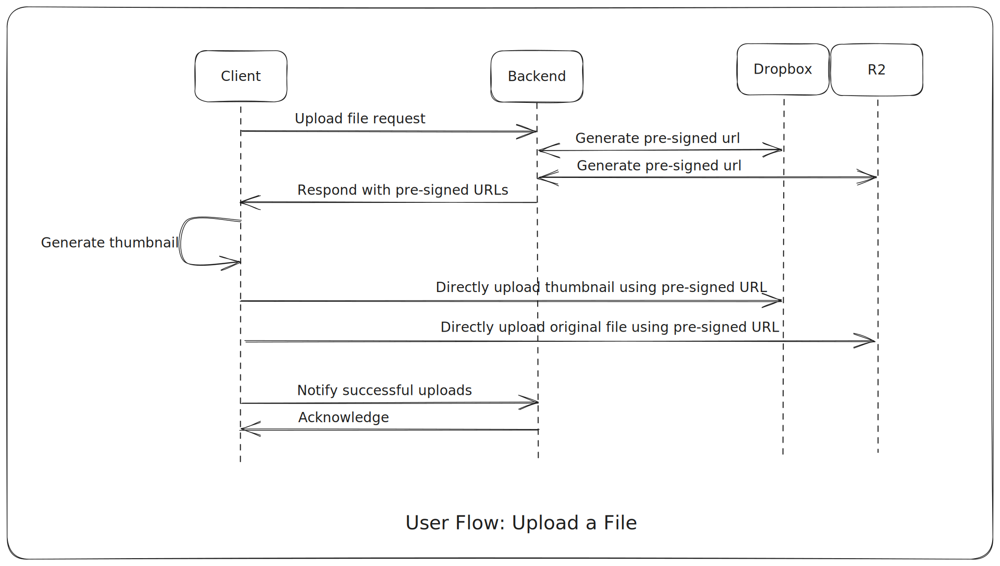
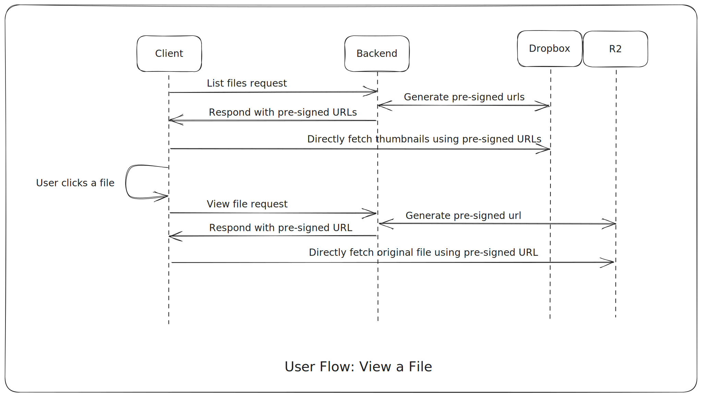

# MyBox

## Description

MyBox is a self-hosted cloud storage service built on top of Cloudflare R2 and Dropbox.

## Motivation

Consumer facing cloud storage services such as Drive and Dropbox have limited storage capacity for their free tier users. As the data grow, it becomes challenging to locate data across different platforms and remove old and duplicated ones.

MyBox's primary goal is to create a unified application to store files on the cloud at little to no cost. A unified application ensures easier file management and feature extensions in the future.

## Architecture

The application uses client-server architecture. The client is a web application and the backend server is a FastAPI HTTP server.

The backend communicates with R2 and Dropbox through their respective Python SDK.

## User flows

### Upload a file

When an upload file request is sent from the client, the backend generates presigned URLs from Dropbox and R2 instead of directly uploading the file. The client uses the presigned URLs sent from the backend to directly upload the thumbnail image to Dropbox and the orignal file to R2. That way, the file data doesn't need to pass through the backend saving a lot of network traffic to the backend.

### View a file

Like the upload flow, when the client requests to view a file, the backend generates presigned URLs instead of fetching the file.

## Future Plan

This project is still evolving. Future plans include supporting batch uploads and improving UX/UI with modern frontend frameworks such as React.

